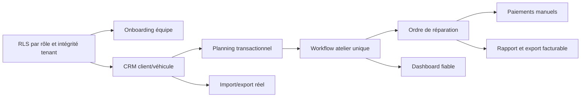

# Matrice des écarts Clikarage - juillet 2026

Audit du commit `a530678d78eb6492af800e2f8373ca4f7c6e0b2f` de `main`.

Source détaillée : `CLIKARAGE_FEATURE_INVENTORY_2026-07.md`.

Les priorités ci-dessous représentent des écarts racines. Une même anomalie peut affecter plusieurs lignes de l'inventaire. Ainsi, les 16 fonctionnalités classées P0 dans l'inventaire se ramènent à quatre chantiers de sécurité et d'intégrité.

## P0 - à corriger avant toute donnée d'un garage payant

| ID | Écart racine | Preuve directe | Impact | Contournement actuel | Taille | Critère de sortie |
|---|---|---|---|---|---|---|
| GAP-P0-01 | Liaison message/demande/garage non garantie | `20260613125606_init_schema.sql:175-182`; `20260717131215_harden_branding_storage_and_performance.sql:156-181` | Un message peut associer la demande d'un tenant au `garage_id` d'un autre, puis être visible au mauvais garage | Ne pas utiliser la messagerie avec de vraies données; insuffisant pour un client payant | M | FK/contrainte composite `(request_id, garage_id)`, policies alignées et tests d'identifiants forgés |
| GAP-P0-02 | Tout membre actif dispose de CRUD trop larges, y compris DELETE | `20260613125656_rls.sql:67-72,130-143`; `20260702131056_requests_delete_member.sql` | Mécanicien, viewer mal mappé ou réceptionnaire peuvent altérer ou supprimer clients, véhicules, réparations, devis, documents, tâches ou demandes | Discipline organisationnelle uniquement; pas une mesure de sécurité | L | Matrice de permissions serveur par action, archivage, refus explicite des rôles non habilités |
| GAP-P0-03 | Conversion demande vers rendez-vous non transactionnelle et non idempotente | `supabase/functions/request-to-appointment/index.ts:68-140`; absence de contrainte unique sur `appointments.service_request_id` | Un échec ou un double clic peut laisser client/véhicule/rendez-vous partiels ou dupliqués | Réconciliation manuelle après incident | L | RPC transactionnelle avec verrou, unicité et retry idempotent |
| GAP-P0-04 | Journal d'audit non fiable | `audit_logs` dans `20260613125606_init_schema.sql:289-297`; policy `audit_insert_member` à `20260613125656_rls.sql:149-153`; aucune écriture applicative | Les actions sensibles ne sont pas tracées et un membre peut forger l'acteur/métadonnées | Logs de plateforme, sans sémantique métier ni preuve exploitable | L | Événements serveur append-only, acteur imposé par `auth.uid()`, accès et rétention contrôlés |

## P1 - bloque le premier garage payant ou un parcours principal

| ID | Domaine | Écart | Preuve | Dépendances | Taille | Critère de sortie |
|---|---|---|---|---|---|---|
| GAP-P1-01 | Onboarding | Aucun flux de création organisation/centre/propriétaire | `SignupPage.tsx:65` crée uniquement un client; aucune mutation de création garage | GAP-P0-02, Auth | M | Provisioning administratif transactionnel et audit |
| GAP-P1-02 | Auth | Invitation dirigeant/salarié et récupération de mot de passe absentes | `TeamPage.tsx:49`; aucune occurrence `resetPasswordForEmail` | Email Auth staging/production | M | Invitation, activation, récupération et révocation E2E |
| GAP-P1-03 | Équipe | Désactivation et changement de rôle non exposés | `garage_members` existe; `TeamPage.tsx` est en lecture | GAP-P0-02 | M | UI + RPCs protégées + audit |
| GAP-P1-04 | Rôles | Les rôles legacy, organisation et centre ne forment pas une autorité unique | migration `20260715050000`; commentaire de compatibilité; `ProShell.tsx` ne filtre pas par rôle | GAP-P0-02 | L | Une matrice centrale UI/SQL |
| GAP-P1-05 | Clients | Modification, archivage, déduplication et portail invité manquent | `ClientsPage.tsx`; table sans `archived_at`; aucun invite | Onboarding, audit | L | Fiche client complète, archive et fusion contrôlée |
| GAP-P1-06 | Véhicules | Deux dossiers véhicule divergents | tables `vehicles` et `client_vehicles`; Edge Function recrée un véhicule garage | Migration additive de réconciliation | XL | Identité véhicule canonique et liens client/garage |
| GAP-P1-07 | Véhicules | Historique kilométrage/propriétaires et timeline unique absents | aucune table d'événements correspondante | GAP-P1-06 | L | Événements append-only et vue agrégée |
| GAP-P1-08 | Rendez-vous | Aucune capacité, conflit, reschedule complet, assignation ou historique | `BookingFlow.tsx` calcule les créneaux depuis `garage_hours`; `CalendarPage.tsx` est une liste | GAP-P0-03 | L | Planification serveur avec contraintes |
| GAP-P1-09 | Atelier | Le runtime réel utilise le workflow legacy non protégé | `WorkshopPage.tsx`; `workshopTimelineEnabled()` vaut false hors démo/env | GAP-P0-02 | L | Workflow serveur unique activable progressivement |
| GAP-P1-10 | Atelier | Réception structurée, état d'entrée, niveau carburant/charge absents | aucune table/composant de réception | GAP-P1-06 | M | Fiche d'entrée immuable |
| GAP-P1-11 | Atelier | Pièces réalisées, main-d'œuvre, technicien et temps réel absents | `quote_lines` ne sont pas des lignes d'exécution; aucun time entry | OR | L | Exécution structurée et rentabilité |
| GAP-P1-12 | Atelier | Ordre de réparation absent | aucune table, route ou RPC OR | Devis | L | OR issu d'une version de devis acceptée |
| GAP-P1-13 | Paiements | Aucun suivi manuel d'acompte, partiel, solde ou remboursement | aucune table; `legalConfig.paymentEnabledInApp=false` | OR/facturation | L | Ledger manuel non destructif |
| GAP-P1-14 | Documents | Facture/export facturable absent | `invoice` seulement valeur d'attachment | Paiements | L | Export structuré avec numérotation adaptée |
| GAP-P1-15 | Devis | Preuve de décision perfectible et aucune conversion OR | quote figée et horodatée, sans hash dédié du contenu accepté | OR | M | Snapshot/hash de décision et conversion |
| GAP-P1-16 | Portail | Le devis public n'est pas intégré à l'historique authentifié | `/devis/:token` séparé de `/app` | Dossier véhicule | M | Liste tenant-safe des devis et documents |
| GAP-P1-17 | Notifications | Outbox réelle mais aucune inbox client et module OFF | `notification_outbox`; `NotificationsPage`; feature flag | Activation contrôlée | M | Inbox interne et états lu/non lu |
| GAP-P1-18 | Imports | Import CSV uniquement simulé | `DemoCsvImportAdapter`; message « aucun adaptateur serveur » | Dédup clients/véhicules | L | Dry-run serveur, job idempotent et rollback |
| GAP-P1-19 | Réversibilité | Aucun export organisation/client/véhicule/intervention | aucune mutation/export dédiée | Dossier central | L | Exports tenant-scoped et manifeste |
| GAP-P1-20 | Dashboard | KPIs atelier incohérents avec flags OFF | Dashboard lit `workshop_stage`; workflow réel peut rester legacy/NULL | Workflow unique | M | Métriques calculées sur la source active |
| GAP-P1-21 | Performance | Toutes les listes principales chargent les lignes complètes | `useCustomers`, `useVehicles`, `useAppointments`, `useQuotes` font `select('*')` sans pagination | API/UX | L | Pagination, tri stable et recherche serveur |
| GAP-P1-22 | Support | Aucun suivi d'erreurs corrélé | absence d'ErrorBoundary ou de client d'observabilité | Gouvernance PII | M | Capture d'erreurs redigée et alerting |
| GAP-P1-23 | Cycle de vie | Suppression/anonymisation non orchestrée | FK cascades et absence de workflow RGPD | Audit/export | L | Export, rétention, archive et anonymisation |
| GAP-P1-24 | Edge IA | Fonctions IA non utilisées, sans guard métier local | `generate-vehicle-ad/index.ts`, `repair-summary/index.ts`; aucune invocation frontend | Flags fournisseur | M | Auth/tenant/rôle/flag/quota côté fonction avant déploiement avec clé |
| GAP-P1-25 | Juridique | Validation humaine et gouvernance d'activation encore requises | `PRODUCT_ACTIVATION.md`; registres non effectifs; flags OFF | Décision humaine | M | Validation juridique, procédure à deux personnes et preuve d'activation |

## P2 - important au quotidien, contournement temporaire possible

| ID | Domaine | Écart | Preuve | Taille | Critère de sortie |
|---|---|---|---|---|---|
| GAP-P2-01 | Onboarding | Pas d'assistant ni checklist | aucune route/composant | M | Checklist persistée et validation readiness |
| GAP-P2-02 | Paramètres | Horaires et centres non éditables | Settings + hooks centres en lecture | M | CRUD centre/horaires |
| GAP-P2-03 | CRM | Pas de fiche client ni timeline interactions | ClientsPage liste seulement | M | Détail agrégé |
| GAP-P2-04 | Véhicules | Photos/documents/garantie non centralisés | attachments par demande, garantie libre | M | Onglets véhicule |
| GAP-P2-05 | Agenda | Pas de grille jour/semaine/mois | CalendarPage liste | M | Calendrier responsive |
| GAP-P2-06 | Atelier | Photos non typées entrée/sortie et contrôle qualité non structuré | AttachmentsPanel; stage QC | M | Checklist et types |
| GAP-P2-07 | Devis | Remises non exposées et historique peu lisible | `discount_total`; QuotesPage | S | Remise et timeline |
| GAP-P2-08 | Messagerie | Pas de lu/non lu ni pièces jointes message | schéma messages minimal | M | Reçus et attachments |
| GAP-P2-09 | Notifications | Couverture événementielle et consentements à compléter | outbox/reminders | M | Matrice événement/canal |
| GAP-P2-10 | Dashboard | Agrégats calculés dans le navigateur | DashboardPage | M | RPCs agrégées |
| GAP-P2-11 | Administration | Console organisations et suspension absentes | platform_admins backend seulement | L | Console sécurisée |
| GAP-P2-12 | Accessibilité | Aucun audit axe/E2E clavier; focus modal incomplet | tests composants limités | M | WCAG automatisé et manuel |
| GAP-P2-13 | Qualité | Comptes de démonstration exposés sur le login | LoginPage + test des quatre comptes | S | Route démo séparée |
| GAP-P2-14 | Qualité | Bundle principal et React PDF volumineux | build : 830.89 kB et 1,457.66 kB minifiés | M | Lazy-load et budgets |
| GAP-P2-15 | Tests | Contrat de hash SQL non portable CRLF/LF | `legalEvidenceLifecycle.contract.test.ts`; 431/432 sous Windows | XS | Hash d'un contenu normalisé |
| GAP-P2-16 | Tests | Pas d'E2E ni tests pages métier/mobile | 70 tests, aucun Playwright/Cypress; 46 pages dont les pages opérationnelles sans test dédié | L | Parcours critiques en navigateur |
| GAP-P2-17 | i18n | Quelques littéraux visibles hors traduction et pas d'E2E complet | `ClientsPage.tsx` « Marketing OK »; `BookingsPage.tsx` label « Heure » | S | Scan et tests visuels FR/EN/AR |
| GAP-P2-18 | Logs | Innocuité des logs Production indéterminée depuis le code | aucun pipeline de redaction testable | M | Contrat de logs sans PII |

## P3 - croissance ou optimisation

| ID | Domaine | Écart | Phase | Taille | Raison |
|---|---|---|---|---|---|
| GAP-P3-01 | Commerce VO | Module acquisition, stock, prospects, vente, livraison et marge absent | PLUS_TARD | XL | Hors chemin critique après-vente du premier garage |
| GAP-P3-02 | Commerce VO | Générateur d'annonce isolé | PLUS_TARD | M | Ne doit pas être activé avant le module et les guards |
| GAP-P3-03 | Réseau | Dashboard et transferts sous flag | CROISSANCE | L | Inutile pour un indépendant |
| GAP-P3-04 | Satisfaction | Aucun modèle de collecte | CROISSANCE | M | Ne pas afficher de métrique simulée |
| GAP-P3-05 | Canaux externes | SMS, push, email transactionnel | A_NE_PAS_CONSTRUIRE_MAINTENANT | L | L'inbox interne suffit au premier lot |
| GAP-P3-06 | Impersonation | Fonction absente | A_NE_PAS_CONSTRUIRE_MAINTENANT | XL | Risque supérieur au bénéfice MVP |
| GAP-P3-07 | UI | 404 logo historique avec fallback | PREMIERS_CLIENTS | XS | Non bloquant, mais bruit réseau |
| GAP-P3-08 | Tooling | Deux avertissements Fast Refresh | PREMIERS_CLIENTS | XS | Pas d'impact runtime |
| GAP-P3-09 | Framework | Warnings React Router v7 dans les tests | CROISSANCE | S | Migration future |

## Dépendances critiques

