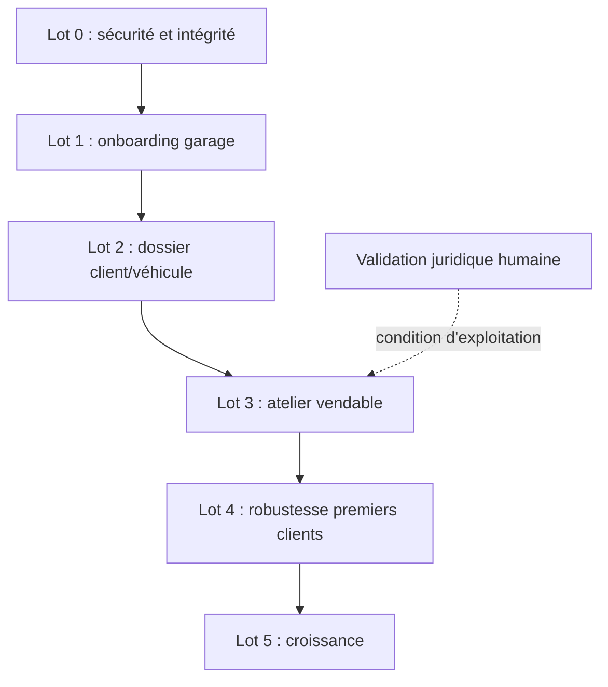

# Roadmap MVP Clikarage - juillet 2026

Cette roadmap part de l'état réel du commit
`a530678d78eb6492af800e2f8373ca4f7c6e0b2f`. Elle ne constitue ni une
activation juridique ni une autorisation de déploiement. Tous les flags restent OFF.

## Position produit recommandée

Clikarage peut aujourd'hui démontrer une expérience après-vente cohérente et faire
fonctionner des réservations, un CRM minimal et des devis réels. Il ne doit pas encore
être vendu comme un DMS, un logiciel de facturation, un outil de paiement ou une
plateforme de commerce VO complète.

Le premier périmètre commercial raisonnable est :

> gestion de la relation client atelier, du rendez-vous à la restitution, avec devis,
> suivi interne, documents de restitution et portail client, sans comptabilité certifiée,
> sans paiement en ligne et sans commerce VO.

Même ce périmètre exige les lots 0 à 3 ci-dessous.

## Lot 0 - sécurité et intégrité

Phase : `PILOTE_OBLIGATOIRE`

| Ordre | Chantier | Taille | Dépendances | Livrable |
|---|---|---|---|---|
| 1 | Fermer la liaison croisée `service_request_messages` | M | Aucune | FK composite, policies et tests forgés |
| 2 | Remplacer les policies CRUD « tout membre » par une matrice de rôles | L | Décision produit sur les rôles | Policies par action et tests Data API |
| 3 | Supprimer les DELETE destructifs des objets historiques | M | Matrice de rôles | Archivage et procédures de rétention |
| 4 | Rendre la conversion demande/rendez-vous transactionnelle et idempotente | L | Schéma appointments | RPC avec verrou et unicité |
| 5 | Construire un journal d'audit serveur fiable | L | Matrice de rôles | Triggers/RPC append-only et console minimale |

Critère de sortie : aucun P0 de `CLIKARAGE_GAP_MATRIX_2026-07.md` ouvert et
tests RLS forgés exécutés localement puis sur staging.

## Lot 1 - entrée du premier garage

Phase : `PILOTE_OBLIGATOIRE`

| Ordre | Chantier | Taille | Dépendances | Livrable |
|---|---|---|---|---|
| 6 | Provisioning organisation, centre et propriétaire | M | Lot 0 | Flux administratif transactionnel |
| 7 | Invitations dirigeant/salariés et récupération de mot de passe | M | Email Auth contrôlé | Activation, expiration et révocation |
| 8 | Gestion d'équipe, désactivation et changements de rôle | M | Matrice de rôles | Écran propriétaire + audit |
| 9 | Paramètres complets garage/centre/horaires | M | Provisioning | Configuration de mise en service |
| 10 | Assistant et checklist onboarding | M | Chantiers 6-9 | Statut readiness vérifiable |
| 11 | Import CSV réel clients/véhicules | L | Déduplication et modèle véhicule | Dry-run, transaction, erreurs et retry |
| 12 | Export initial clients/véhicules | M | Isolation tenant | Réversibilité minimale |

Critère de sortie : un dirigeant peut être invité, configurer son garage, inviter son
équipe, importer des données fictives, exporter celles-ci et récupérer son accès sans
intervention SQL.

## Lot 2 - dossier client et véhicule

Phase : `PILOTE_OBLIGATOIRE`

| Ordre | Chantier | Taille | Dépendances | Livrable |
|---|---|---|---|---|
| 13 | Fiche client éditable et archivable | M | Lot 0 | Détail, consentements, archive |
| 14 | Stratégie de déduplication client | M | Import | Fusion contrôlée |
| 15 | Identité véhicule canonique | XL | Migration de compatibilité | Fin des copies garage/client divergentes |
| 16 | Historique kilométrage et propriétaire | L | Véhicule canonique | Événements append-only |
| 17 | Timeline véhicule/client unique | L | Modèles client/véhicule | Vue agrégée paginée |
| 18 | Invitation client liée au CRM | M | Auth + client canonique | Portail sans doublon de customer |

Critère de sortie : chaque véhicule possède une seule identité fonctionnelle et reste
consultable depuis le CRM, l'atelier et le portail.

## Lot 3 - parcours atelier vendable

Phase : `PILOTE_OBLIGATOIRE`

| Ordre | Chantier | Taille | Dépendances | Livrable |
|---|---|---|---|---|
| 19 | Capacité, conflits, assignation et reschedule de l'agenda | L | Conversion idempotente | Planning serveur |
| 20 | Unifier le workflow legacy et la timeline avancée | L | Lot 0 | Une seule state machine |
| 21 | Fiche de réception et contrôle d'entrée | M | Véhicule canonique | Kilométrage, énergie, dommages, photos |
| 22 | Diagnostic, recommandations et décisions | M | Workflow unique | Activation progressive du module existant |
| 23 | Ordre de réparation versionné | L | Devis accepté | OR figé et autorisé |
| 24 | Pièces, main-d'œuvre, technicien et temps passé | L | OR | Exécution structurée |
| 25 | Contrôle qualité et restitution | M | Workflow/OR | Checklist, photos, véhicule prêt |
| 26 | Rapport de restitution et documents client | M | Attachments/report existants | Finalisation immuable et accès portail |
| 27 | Paiements manuels | L | OR + total facturable | Acompte, partiel, solde, remboursement |
| 28 | Export facturable | L | Paiements et OR | Document structuré sans prétendre être une caisse certifiée |

Critère de sortie : le scénario atelier complet réussit en deux sessions isolées, avec
historique, autorisations, retry et aucune donnée résiduelle.

## Lot 4 - robustesse des premiers clients

Phase : `PREMIERS_CLIENTS`

| Chantier | Taille | Résultat |
|---|---|---|
| Pagination et recherche serveur | L | Listes stables à 10 000 lignes |
| Observabilité et ErrorBoundary | M | Incidents corrélés sans PII |
| Inbox de notifications internes | M | Événements utiles sans fournisseur externe |
| Pièces jointes message et lu/non lu | M | Messagerie exploitable |
| Accessibilité et tests mobile | M | Parcours clavier et écrans étroits validés |
| E2E Auth/CRM/atelier/portail | L | Couverture comportementale réelle |
| Performance bundle | M | PDF et fonctions avancées chargés à la demande |
| Runbook support, sauvegarde, export et suppression | M | Exploitation répétable |
| Validation juridique humaine | M | Précondition contractuelle, flags toujours OFF jusqu'à autorisation |

## Lot 5 - croissance

Phase : `CROISSANCE`

- Activer le dashboard réseau seulement pour les organisations multi-centres.
- Finaliser les transferts centre à centre et leurs disponibilités.
- Ajouter la satisfaction réelle après définition d'une méthode de collecte.
- Connecter les providers externes un par un, avec contrat, secret serveur,
  consentement, quotas et monitoring.
- Construire le commerce VO comme un produit distinct si la demande commerciale
  est confirmée. Ne pas détourner la table `vehicles` atelier pour simuler un stock.

## À ne pas construire maintenant

- Paiement en ligne Stripe : le suivi manuel des paiements est prioritaire.
- WhatsApp ou SMS : l'inbox interne doit d'abord être fiable.
- Impersonation support : utiliser des diagnostics et une délégation limitée.
- Multidiffusion d'annonces : le module VO complet n'existe pas encore.
- IA de diagnostic : les deux Edge Functions actuelles sont inutilisées et ne
  possèdent pas encore les guards métier suffisants.

## Top 10 des actions

1. Corriger l'intégrité tenant des messages.
2. Appliquer une vraie matrice de permissions SQL et UI.
3. Rendre la conversion demande/rendez-vous transactionnelle et idempotente.
4. Remplacer les suppressions destructives par l'archivage et fiabiliser l'audit.
5. Construire le provisioning et les invitations garage.
6. Unifier le dossier véhicule entre CRM et portail.
7. Finaliser le planning serveur avec conflits et assignations.
8. Ajouter l'ordre de réparation, les lignes réalisées et les temps.
9. Ajouter le suivi manuel des paiements et l'export facturable.
10. Livrer un import/export réel et des E2E atelier/portail.

## Estimation globale par tailles

L'inventaire de 197 lignes contient :

| Taille | Nombre de fonctionnalités |
|---|---:|
| XS | 13 |
| S | 33 |
| M | 99 |
| L | 48 |
| XL | 4 |

Ces nombres ne doivent pas être additionnés comme des jours : de nombreuses lignes
partagent le même chantier racine. La roadmap regroupe ces doublons en environ
28 chantiers avant robustesse et croissance. Les éléments XL, notamment le véhicule
canonique et le commerce VO, nécessitent un découpage de conception.

## Séquence de release recommandée

Chaque lot doit être validé localement, sur staging et par un parcours navigateur.
Supabase Production et les feature flags ne doivent être modifiés que par un runbook
séparé et autorisé.
