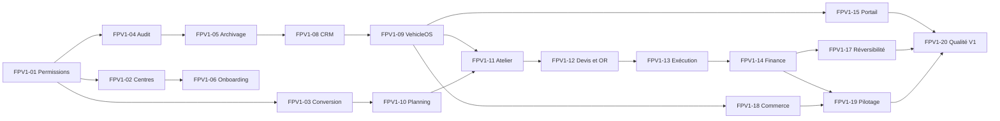

# Roadmap d'implémentation du Full Product Commercial V1

## Référence et règles

Cette roadmap transforme le [périmètre V1](./FULL_PRODUCT_V1.md) en lots
livrables à partir de `main` au SHA
`7ecb3a6fe840401170ea081be084d490c1ee6f7a`.

Elle utilise les audits de juillet 2026 comme baseline, sans les reproduire :

- [inventaire](../audits/CLIKARAGE_FEATURE_INVENTORY_2026-07.md) ;
- [matrice des écarts](../audits/CLIKARAGE_GAP_MATRIX_2026-07.md) ;
- [roadmap MVP](../audits/CLIKARAGE_MVP_ROADMAP_2026-07.md) ;
- [couverture des tests](../audits/CLIKARAGE_TEST_COVERAGE_MATRIX_2026-07.md).

Évolutions déjà fermées depuis l'audit :

- Phase 2 : hash de migration portable CRLF/LF ;
- Phase 3 : isolation tenant et centre de la messagerie ;
- Phase 4A : protection initiale contre l'escalade des appartenances.

Phase 4B et les permissions métier détaillées ne sont pas commencées.

## Priorisation

L'ordre suit strictement :

1. sécurité et intégrité ;
2. blocage du parcours métier ;
3. capacité de vente ;
4. fréquence d'utilisation ;
5. différenciation ;
6. confort et optimisation.

La facilité technique ne détermine jamais seule la priorité.

## Vue d'ensemble

| Lot | Intitulé | Priorité | Risque | PR indicatives |
|---|---|---|---|---:|
| FPV1-01 | Permissions métier serveur restantes | P0 | Critique | 4 à 6 |
| FPV1-02 | Périmètre centre et transferts fail-closed | P0 | Critique | 3 à 4 |
| FPV1-03 | Conversion demande/rendez-vous transactionnelle | P0 | Critique | 2 |
| FPV1-04 | Journal d'audit append-only fiable | P0 | Critique | 3 à 4 |
| FPV1-05 | Archivage, rétention et fin des cascades destructives | P0 | Critique | 3 à 4 |
| FPV1-06 | Auth, provisioning et gestion d'équipe | P1 | Critique | 4 à 5 |
| FPV1-07 | Configuration garage, centres et catalogue | P1 | Moyen | 3 à 4 |
| FPV1-08 | CRM client canonique | P1 | Moyen | 4 à 5 |
| FPV1-09 | VehicleOS et identité véhicule canonique | P1 | Critique | 5 à 7 |
| FPV1-10 | Planning, capacité et historique des rendez-vous | P1 | Critique | 4 à 5 |
| FPV1-11 | Workflow atelier unique et réception | P1 | Critique | 4 à 6 |
| FPV1-12 | Devis, preuve de décision et ordre de réparation | P1 | Critique | 4 à 5 |
| FPV1-13 | Exécution atelier, contrôle qualité et restitution | P1 | Critique | 4 à 6 |
| FPV1-14 | Finance opérationnelle et ledger | P1 | Critique | 5 à 7 |
| FPV1-15 | Portail et relation client | P1 | Moyen | 4 à 6 |
| FPV1-16 | Documents, notifications et messagerie complète | P1 | Moyen | 3 à 5 |
| FPV1-17 | Imports, exports et réversibilité | P1 | Critique | 3 à 4 |
| FPV1-18 | Commerce automobile | P1 | Critique | 6 à 9 |
| FPV1-19 | Pilotage et agrégats réseau | P1 | Moyen | 3 à 5 |
| FPV1-20 | Qualité, E2E, performance et exploitation | P2 | Moyen | 5 à 7 |

**Estimation globale : 76 à 106 PR ciblées.** Cette estimation exprime le
volume de découpage sécurisé d'un produit complet, pas un calendrier.

## Chemin critique

Les lots indépendants peuvent avancer en parallèle uniquement lorsque leurs
contrats partagés sont figés et que chaque lot conserve sa propre PR.

## Lots détaillés

### FPV1-01 — Permissions métier serveur restantes

- **Objectif métier :** appliquer la [matrice des rôles](./ROLE_MATRIX.md) à
  toutes les actions sensibles.
- **Périmètre :** clients, véhicules, demandes, rendez-vous, atelier, devis,
  documents, paiements, exports et administration.
- **Déjà présent :** RLS générale, helpers d'appartenance, Phase 3 et Phase 4A.
- **Manquant :** capacités par action ; rôles atelier, commercial, comptabilité
  et viewer ; refus Data API des CRUD legacy trop larges.
- **Dépendances :** décisions de rôles déjà figées ; Phase 4A en Production.
- **Risque / modèle :** critique — **GPT-5 Codex — Élevé**.
- **Migrations probables :** policies additives/remplacées, helpers de
  capacités, RPC exclusives et révocations de grants.
- **Tests nécessaires :** matrice Data API par rôle, cross-tenant,
  cross-centre, auto-escalade, DML direct et frontend.
- **Critère de sortie :** aucune action interdite n'est exécutable par appel
  Supabase direct ; UI et serveur utilisent la même capacité.
- **PR indicatives :** 4 à 6, par domaine de permissions.
- **Passage :** inventaire complet des grants/policies vert sur local et staging.

### FPV1-02 — Périmètre centre et transferts fail-closed

- **Objectif métier :** garantir qu'un rôle local ne sort jamais de ses centres.
- **Périmètre :** appartenance sans centre, lecture centre, changements de
  centre, dossiers partagés et transferts historisés.
- **Déjà présent :** `garage_centers`, rôles organisation/centre, helpers et
  RPC de transfert partiels.
- **Manquant :** enforcement uniforme sur les tables legacy, suppression de
  toute exception sans périmètre et workflow complet de transfert.
- **Dépendances :** FPV1-01.
- **Risque / modèle :** critique — **GPT-5 Codex — Élevé**.
- **Migrations probables :** contraintes tenant/centre, policies et événements
  de transfert append-only.
- **Tests nécessaires :** centre A1/A2, organisation A/B, centre étranger,
  membre sans centre, transfert concurrent et rollback.
- **Critère de sortie :** accès nul sans périmètre ; aucun transfert silencieux ;
  historique complet avant/après.
- **PR indicatives :** 3 à 4.
- **Passage :** tous les modules métier prouvent leur isolation centre.

### FPV1-03 — Conversion demande/rendez-vous transactionnelle

- **Objectif métier :** convertir une demande sans doublon ni état partiel.
- **Périmètre :** client, véhicule, rendez-vous, liaison demande, audit et clé
  d'idempotence.
- **Déjà présent :** Edge Function séquentielle et tables concernées.
- **Manquant :** transaction PostgreSQL, verrou, unicité et retry stable.
- **Dépendances :** FPV1-01 ; contrat VehicleOS anticipé avec FPV1-09.
- **Risque / modèle :** critique — **GPT-5 Codex — Élevé**.
- **Migrations probables :** contrainte unique et RPC transactionnelle.
- **Tests nécessaires :** succès, erreur intermédiaire, double clic, retry,
  appels concurrents, cross-tenant et rendez-vous déjà converti.
- **Critère de sortie :** un même `operation_id` produit un résultat unique et
  tout échec restaure le baseline.
- **PR indicatives :** 2.
- **Passage :** charge concurrente et rollback prouvés sur staging.

### FPV1-04 — Journal d'audit append-only fiable

- **Objectif métier :** rendre les actions sensibles traçables sans falsification.
- **Périmètre :** statuts, devis, paiements, conversion, affectations, rôles,
  restitution, archivage et administration.
- **Déjà présent :** table `audit_logs` et logs de plateforme.
- **Manquant :** acteur serveur, taxonomie, corrélation, append-only, rétention
  et lectures bornées.
- **Dépendances :** FPV1-01 ; contrats d'événements des domaines futurs.
- **Risque / modèle :** critique — **GPT-5 Codex — Élevé**.
- **Migrations probables :** journal versionné, triggers/RPC et révocation DML.
- **Tests nécessaires :** acteur/date forgés, update/delete refusés,
  cross-tenant, minimisation PII, événement dans la même transaction.
- **Critère de sortie :** chaque action critique produit exactement un événement
  immuable et corrélé.
- **PR indicatives :** 3 à 4.
- **Passage :** taxonomie et rétention validées humainement.

### FPV1-05 — Archivage, rétention et fin des cascades destructives

- **Objectif métier :** préserver l'historique tout en permettant le cycle de vie
  et les obligations réglementaires.
- **Périmètre :** clients, véhicules, demandes, messages, interventions, devis,
  documents, paiements et commerce.
- **Déjà présent :** statuts partiels et quelques archives juridiques.
- **Manquant :** `archived_at`, procédures de restauration, rétention,
  anonymisation séparée et suppression des cascades dangereuses.
- **Dépendances :** FPV1-04.
- **Risque / modèle :** critique — **GPT-5 Codex — Élevé**.
- **Migrations probables :** colonnes d'archive, contraintes et politiques
  `RESTRICT` ou procédures contrôlées.
- **Tests nécessaires :** archive/restauration, historique conservé, suppression
  directe refusée, demandes avec messages, données financières.
- **Critère de sortie :** aucune action métier ordinaire ne détruit un historique.
- **PR indicatives :** 3 à 4.
- **Passage :** procédure réglementaire séparée documentée, non exposée.

### FPV1-06 — Auth, provisioning et gestion d'équipe

- **Objectif métier :** rendre un garage autonome sans intervention SQL ni
  connaissance des mots de passe.
- **Périmètre :** création autorisée, owner, invitations, activation, recovery,
  désactivation et rôles.
- **Déjà présent :** Supabase Auth, signup client, tables organisation/membres et
  RPC Phase 4A.
- **Manquant :** provisioning transactionnel, invitation staff, récupération,
  UI équipe et statut de mise en service.
- **Dépendances :** FPV1-01, FPV1-02 et FPV1-04.
- **Risque / modèle :** critique — **GPT-5 Codex — Élevé**.
- **Migrations probables :** invitations, tokens bornés, statut onboarding et
  RPC de provisioning.
- **Tests nécessaires :** expiration, replay, owner final, rôle égal/supérieur,
  centre étranger, session désactivée et E2E Auth.
- **Critère de sortie :** un owner configure l'accès de son équipe sans canal
  administratif caché.
- **PR indicatives :** 4 à 5.
- **Passage :** onboarding d'une organisation synthétique complet sur staging.

### FPV1-07 — Configuration garage, centres et catalogue

- **Objectif métier :** rendre l'établissement exploitable après activation.
- **Périmètre :** identité, coordonnées, logo, horaires, centres, capacité
  initiale et prestations.
- **Déjà présent :** pages Settings, heures, services et centres en lecture.
- **Manquant :** CRUD borné, validations, versionnement utile et checklist.
- **Dépendances :** FPV1-06.
- **Risque / modèle :** moyen — **GPT-5 Codex — Moyen**.
- **Migrations probables :** contraintes de configuration et readiness.
- **Tests nécessaires :** rôle, centre, horaires chevauchants, upload logo,
  états vides et mobile.
- **Critère de sortie :** un garage configure ses établissements sans support.
- **PR indicatives :** 3 à 4.
- **Passage :** checklist de readiness déterministe.

### FPV1-08 — CRM client canonique

- **Objectif métier :** fournir une fiche client fiable pour particuliers et
  entreprises.
- **Périmètre :** identité, coordonnées, consentements, notes, recherche,
  déduplication, fusion, archivage et invitation portail.
- **Déjà présent :** liste, création et recherche minimale.
- **Manquant :** fiche complète, entreprise, timeline, fusion et permissions
  détaillées.
- **Dépendances :** FPV1-01, FPV1-04, FPV1-05 et FPV1-06.
- **Risque / modèle :** moyen — **GPT-5 Codex — Moyen**.
- **Migrations probables :** identité canonique, consentements, notes et clés de
  déduplication.
- **Tests nécessaires :** doublons, fusion, archive, consentements, export,
  cross-tenant et listes volumineuses.
- **Critère de sortie :** une fiche unique relie tous les objets autorisés.
- **PR indicatives :** 4 à 5.
- **Passage :** import et portail peuvent référencer la même identité.

### FPV1-09 — VehicleOS et identité véhicule canonique

- **Objectif métier :** un véhicule, un dossier unique et tout son historique.
- **Périmètre :** réconciliation `vehicles`/`client_vehicles`, VIN,
  immatriculation, caractéristiques, propriétaires, kilométrage, documents et
  timeline.
- **Déjà présent :** deux modèles véhicule, créations garage/client et partage
  partiel.
- **Manquant :** identité canonique, stratégie de migration, historique de
  propriété et vue agrégée.
- **Dépendances :** FPV1-05 et FPV1-08.
- **Risque / modèle :** critique — **GPT-5 Codex — Élevé**.
- **Migrations probables :** table/référence canonique, aliases, événements,
  contraintes de fusion et vues.
- **Tests nécessaires :** dédup VIN/plaque, conflits, propriétaires, cross-tenant,
  rétrocompatibilité, migration sans perte et timeline paginée.
- **Critère de sortie :** CRM, atelier, portail et commerce utilisent le même ID
  véhicule.
- **PR indicatives :** 5 à 7.
- **Passage :** comparaison avant/après sans référence orpheline.

### FPV1-10 — Planning, capacité et historique des rendez-vous

- **Objectif métier :** planifier une charge réaliste par centre et équipe.
- **Périmètre :** durée, créneaux serveur, conflits, capacités, assignations,
  report, annulation et vues jour/semaine/mois.
- **Déjà présent :** demande client, acceptation/refus et calendrier liste.
- **Manquant :** moteur de disponibilité, contraintes et historique complet.
- **Dépendances :** FPV1-02, FPV1-03, FPV1-07 et FPV1-09.
- **Risque / modèle :** critique — **GPT-5 Codex — Élevé**.
- **Migrations probables :** ressources/capacités, événements de planning et
  contraintes temporelles.
- **Tests nécessaires :** chevauchement, timezone, concurrence, report, centre,
  rôles, mobile et E2E client/garage.
- **Critère de sortie :** aucun conflit confirmé sans dérogation autorisée.
- **PR indicatives :** 4 à 5.
- **Passage :** planning stable sous charge et retry.

### FPV1-11 — Workflow atelier unique et réception

- **Objectif métier :** remplacer les workflows concurrents par une state machine
  serveur.
- **Périmètre :** réception, état d'entrée, kilométrage, énergie, dommages,
  photos, transitions et affectation initiale.
- **Déjà présent :** Kanban legacy, timeline avancée et RPC de transition sous
  flag/démo.
- **Manquant :** source unique, migration progressive et fiche d'entrée.
- **Dépendances :** FPV1-09 et FPV1-10.
- **Risque / modèle :** critique — **GPT-5 Codex — Élevé**.
- **Migrations probables :** état canonique, snapshot de réception et événements.
- **Tests nécessaires :** toutes transitions, état concurrent, photos, rôle,
  centre, ancien frontend et reprise des dossiers ouverts.
- **Critère de sortie :** une seule state machine pilote chaque intervention.
- **PR indicatives :** 4 à 6.
- **Passage :** migration des dossiers synthétiques sans double état.

### FPV1-12 — Devis, preuve de décision et ordre de réparation

- **Objectif métier :** transformer une décision client prouvée en contrat
  d'exécution.
- **Périmètre :** devis existants, hash/snapshot accepté, remises, validation,
  refus, version, annulation et ordre de réparation.
- **Déjà présent :** devis serveur, numérotation, versionnement, PDF et route
  publique par token.
- **Manquant :** preuve du contenu, seuils de remise, portail authentifié et OR.
- **Dépendances :** FPV1-04, FPV1-09 et FPV1-11.
- **Risque / modèle :** critique — **GPT-5 Codex — Élevé**.
- **Migrations probables :** snapshot de décision, règles de remise, OR et
  conversion idempotente.
- **Tests nécessaires :** prix modifié, token, double décision, version, remise,
  rôle, conversion OR et rollback.
- **Critère de sortie :** un OR référence exactement une version acceptée.
- **PR indicatives :** 4 à 5.
- **Passage :** devis accepté immuable et OR reproductible.

### FPV1-13 — Exécution atelier, contrôle qualité et restitution

- **Objectif métier :** enregistrer ce qui a réellement été fait et livrer le
  véhicule proprement.
- **Périmètre :** pièces consommées, main-d'œuvre, temps, technicien, notes,
  recommandations, contrôle qualité, photos, véhicule prêt et rapport.
- **Déjà présent :** recommandations, attachments et rapport avancés partiels.
- **Manquant :** lignes d'exécution, temps, contrôles structurés et finalisation.
- **Dépendances :** FPV1-11 et FPV1-12.
- **Risque / modèle :** critique — **GPT-5 Codex — Élevé**.
- **Migrations probables :** lignes réalisées, time entries, checklist et
  finalisation append-only.
- **Tests nécessaires :** affectation, droits technicien, dépassement,
  finalisation/réouverture, rapport, concurrence et mobile atelier.
- **Critère de sortie :** réception à restitution réussit avec historique complet.
- **PR indicatives :** 4 à 6.
- **Passage :** scénario atelier E2E sans contournement.

### FPV1-14 — Finance opérationnelle et ledger

- **Objectif métier :** suivre tout montant dû jusqu'à son règlement ou sa
  correction.
- **Périmètre :** acomptes, partiels, solde, impayés, factures/exports,
  paiements, avoirs, remboursements, coûts et marges.
- **Déjà présent :** totaux de devis ; aucun ledger de paiement.
- **Manquant :** modèle financier, permissions, réconciliation et documents.
- **Dépendances :** FPV1-12 et FPV1-13.
- **Risque / modèle :** critique — **GPT-5 Codex — Élevé**.
- **Migrations probables :** ledger append-only, allocations, statuts, avoirs,
  remboursements et numérotation.
- **Tests nécessaires :** calculs, arrondis, devise, double paiement, immutabilité,
  rôle, remise, refund, export et concurrence.
- **Critère de sortie :** chaque solde est réconciliable et toute correction est
  compensatoire.
- **PR indicatives :** 5 à 7.
- **Passage :** scénario acompte + partiel + solde + remboursement validé.

### FPV1-15 — Portail et relation client

- **Objectif métier :** donner au client une vue sécurisée de tout son parcours.
- **Périmètre :** invitation, véhicules, demandes, devis, décisions, avancement,
  documents, messages, historique et profil limité.
- **Déjà présent :** portail, demande, timeline conditionnelle, véhicule et
  messagerie isolée.
- **Manquant :** invitation CRM, devis authentifiés, bibliothèque de documents,
  recovery et workflow complet.
- **Dépendances :** FPV1-06, FPV1-09, FPV1-12 et FPV1-13.
- **Risque / modèle :** moyen — **GPT-5 Codex — Moyen**.
- **Migrations probables :** liens portail/CRM, préférences et reçus de lecture.
- **Tests nécessaires :** client A/B, invitation/replay, documents, décision,
  messages, coordonnées limitées, mobile et E2E.
- **Critère de sortie :** le client accomplit son parcours sans lien public
  externe obligatoire.
- **PR indicatives :** 4 à 6.
- **Passage :** scénario portail complet et isolé.

### FPV1-16 — Documents, notifications et messagerie complète

- **Objectif métier :** centraliser les échanges et documents opérationnels.
- **Périmètre :** pièces jointes par message, lu/non-lu, inbox, événements,
  rappels, documents et règles de visibilité.
- **Déjà présent :** Storage privé, attachments dossier, outbox, rappels et
  messagerie Phase 3.
- **Manquant :** message/attachment, inbox client, couverture événementielle et
  préférences.
- **Dépendances :** FPV1-13 et FPV1-15.
- **Risque / modèle :** moyen — **GPT-5 Codex — Moyen**.
- **Migrations probables :** reçus, liens attachment/message, inbox et
  préférences.
- **Tests nécessaires :** Storage tenant/client, MIME/taille, URL signée,
  unread, statut fermé, teardown et événements.
- **Critère de sortie :** échanges et documents sont utilisables sans provider
  externe.
- **PR indicatives :** 3 à 5.
- **Passage :** aucune fuite ou notification fantôme.

### FPV1-17 — Imports, exports et réversibilité

- **Objectif métier :** permettre l'entrée, la sortie et la sauvegarde des données.
- **Périmètre :** modèles CSV, preview, validation, déduplication, import sûr,
  exports par domaine et manifeste organisation.
- **Déjà présent :** preview CSV locale, neutralisation de formules et rapports.
- **Manquant :** adaptateur serveur, jobs idempotents, export complet et
  réconciliation.
- **Dépendances :** FPV1-08, FPV1-09, FPV1-13 et FPV1-14.
- **Risque / modèle :** critique — **GPT-5 Codex — Élevé**.
- **Migrations probables :** jobs d'import, staging rows, erreurs et manifests.
- **Tests nécessaires :** fichiers invalides, doublons, reprise, rollback,
  volumétrie, formules, tenant et export/réimport.
- **Critère de sortie :** une organisation peut importer et récupérer ses données
  sans état partiel.
- **PR indicatives :** 3 à 4.
- **Passage :** cycle export/réimport comparé par empreinte.

### FPV1-18 — Commerce automobile

- **Objectif métier :** couvrir acquisition, préparation, vente et garantie dans
  VehicleOS.
- **Périmètre :** stock, provenance, reprise, coûts/frais, préparation, prix,
  prospects, essais, offres, réservation, acompte, vente, livraison et garantie.
- **Déjà présent :** VehicleOS futur, atelier réutilisable et générateur d'annonce
  isolé non activé.
- **Manquant :** tout le modèle commerce persistant et ses parcours.
- **Dépendances :** FPV1-09, FPV1-13, FPV1-14 et FPV1-17.
- **Risque / modèle :** critique — **GPT-5 Codex — Élevé**.
- **Migrations probables :** stock, coûts, prospects, essais, offres,
  réservations, ventes, livraisons, reprises et garanties.
- **Tests nécessaires :** state machine stock, concurrence réservation, coûts,
  prix plancher, marge, vente/livraison atomique, rôles et E2E.
- **Critère de sortie :** scénario vente complet avec marge réelle réconciliée.
- **PR indicatives :** 6 à 9.
- **Passage :** aucune donnée commerce dans un store démo uniquement.

### FPV1-19 — Pilotage et agrégats réseau

- **Objectif métier :** fournir des indicateurs vrais et actionnables.
- **Périmètre :** CA, marge, charge, performance, conversions, impayés, activité
  commerciale, centres et réseau.
- **Déjà présent :** dashboard local, métriques partielles et RPC réseau sous flag.
- **Manquant :** définitions canoniques, agrégats serveur, permissions financières
  et réconciliation.
- **Dépendances :** FPV1-10, FPV1-13, FPV1-14 et FPV1-18.
- **Risque / modèle :** moyen — **GPT-5 Codex — Moyen**.
- **Migrations probables :** fonctions d'agrégat, vues matérialisées si mesurées,
  aucune valeur simulée.
- **Tests nécessaires :** vérité des métriques, périodes, timezone, centres,
  rôle, volumétrie et export.
- **Critère de sortie :** chaque KPI est documenté et reproductible depuis ses
  données sources.
- **PR indicatives :** 3 à 5.
- **Passage :** réconciliation atelier, finance et commerce validée.

### FPV1-20 — Qualité, E2E, performance et exploitation

- **Objectif métier :** rendre le produit complet exploitable et commercialisable.
- **Périmètre :** E2E, mobile, accessibilité, pagination, performance,
  observabilité, ErrorBoundary, support, sauvegarde, restauration et runbooks.
- **Déjà présent :** tests unitaires/contrats, builds, security scan, démos et
  procédures Production éprouvées.
- **Manquant :** E2E committés, budgets, redaction des logs, support outillé,
  tests de longues listes et validation globale V1.
- **Dépendances :** tous les lots fonctionnels.
- **Risque / modèle :** moyen — **GPT-5 Codex — Moyen** ; Élevé pour les
  sous-PR de sécurité ou restauration.
- **Migrations probables :** uniquement si observabilité ou support nécessitent
  des objets persistants.
- **Tests nécessaires :** E2E atelier, vente, client, onboarding, mobile,
  clavier, charge, rollback, backup/restore et smoke Production.
- **Critère de sortie :** aucune page blanche, aucun workflow principal sans
  issue et les quatre scénarios V1 passent sur staging.
- **PR indicatives :** 5 à 7.
- **Passage :** revue finale Full Product V1, runbook de lancement et décision
  humaine de commercialisation.

## Éléments V2 et Enterprise

Les exclusions du [périmètre V1](./FULL_PRODUCT_V1.md) restent hors de ces lots.
Elles ne deviennent pas des dépendances implicites, même si une migration ou un
prototype existe déjà.

La multidiffusion exhaustive, l'IA avancée, l'application native, le white-label
complet, l'API publique générale, tous les DMS, la comptabilité réglementaire,
la fiscalité internationale, les rôles personnalisables et les demandes
spécifiques à un grand groupe sont reportés.

## Condition de sortie globale

Le Full Product Commercial V1 est terminé uniquement lorsque :

- les 20 lots satisfont leurs critères de sortie ;
- les quatre scénarios E2E sont verts sur le même SHA ;
- les permissions sont conformes à la matrice côté serveur ;
- les migrations et backups ont été validés selon le
  [processus de release](./RELEASE_PROCESS.md) ;
- les règles de [sécurité](./SECURITY_RULES.md) sont vérifiées ;
- aucune fonction V2 n'est requise pour exploiter le V1 ;
- une décision humaine autorise explicitement la commercialisation.
